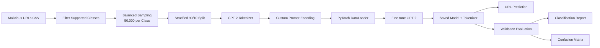
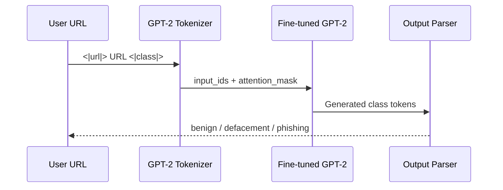

# 🛡️ Phishing URL Detector

### An Information Security project that fine-tunes GPT-2 to classify URLs as **Benign**, **Defacement**, or **Phishing**

<br>

[](https://www.python.org/)
[](https://pytorch.org/)
[](https://huggingface.co/docs/transformers/)
[](https://www.kaggle.com/)
[](#security-purpose)
[](#license)

<br>

**Detect suspicious URL patterns through transformer-based language modeling.**

<div align="center">


<br>

[Overview](#-overview) •
[Architecture](#-system-architecture) •
[Installation](#-installation) •
[Training](#-training-pipeline) •
[Evaluation](#-evaluation) •
[Team](#-project-team)

</div>

---

## 📌 Overview

Phishing websites often imitate trusted services to steal passwords, financial information, and other sensitive data. Their URLs can contain unusual domains, deceptive keywords, misleading subdomains, encoded characters, or manipulated paths.

**Phishing URL Detector** explores a transformer-based approach to this problem. Instead of manually defining URL rules, the project fine-tunes **GPT-2** on labeled URL sequences and teaches it to generate the correct security class after a structured prompt.

The notebook processes a balanced dataset of **150,000 URLs**:

| Security class | Samples | Meaning |
|---|---:|---|
| `benign` | 50,000 | A legitimate or non-malicious URL |
| `defacement` | 50,000 | A URL associated with an altered or compromised website |
| `phishing` | 50,000 | A deceptive URL designed to impersonate or steal information |
| **Total** | **150,000** | Balanced three-class training dataset |

> [!IMPORTANT]
> This repository is an educational Information Security and Machine Learning project. Model predictions should not be treated as a replacement for browser protection, threat intelligence feeds, sandboxing, or professional security analysis.

---

## ✨ Key Highlights

<table>
<tr>
<td width="50%" valign="top">

### 🧠 Transformer-Based Detection

Uses `GPT2LMHeadModel` to learn the relationship between a URL sequence and its security label.

</td>
<td width="50%" valign="top">

### ⚖️ Balanced Dataset

Randomly selects 50,000 examples from each supported class to reduce class imbalance.

</td>
</tr>
<tr>
<td width="50%" valign="top">

### 🧩 Structured Prompt Format

Introduces custom tokens—`<|url|>`, `<|class|>`, and `<|end|>`—to separate the input URL from its target label.

</td>
<td width="50%" valign="top">

### 📊 Complete Validation Flow

Generates a classification report and confusion matrix for the held-out validation split.

</td>
</tr>
<tr>
<td width="50%" valign="top">

### 🚀 GPU-Aware Training

Automatically uses CUDA when available and falls back to CPU when a GPU is unavailable.

</td>
<td width="50%" valign="top">

### 💾 Reusable Model Artifacts

Saves the fine-tuned model and tokenizer using the Hugging Face `save_pretrained()` format.

</td>
</tr>
</table>

---

## 🏗️ System Architecture



### Prediction Flow



---

## 🧬 Prompt Design

Every training example is converted into the following textual structure:

```text
<|url|>
https://example-domain.com/account/login
<|class|>
phishing<|end|>
```

The model learns to continue the prompt by generating the relevant class:

```text
<|url|>
https://example-domain.com/account/login
<|class|>
```

Possible generated outputs are:

```text
benign
defacement
phishing
```

This reframes URL classification as a **controlled language-generation task**.

---

## 🛠️ Technology Stack

| Category | Technology | Role |
|---|---|---|
| Programming | Python | Data processing, training, inference, and evaluation |
| Deep Learning | PyTorch | Tensor operations, optimization, and model execution |
| NLP | Hugging Face Transformers | GPT-2 tokenizer and language model |
| Base Model | GPT-2 | Transformer model fine-tuned for URL classification |
| Data Analysis | Pandas, NumPy | Dataset loading and manipulation |
| Dataset Split | Scikit-learn | Stratified training and validation split |
| Evaluation | Scikit-learn Metrics | Classification report and confusion matrix |
| Visualization | Matplotlib, Seaborn | Evaluation matrix visualization |
| Progress Tracking | tqdm | Live training progress |
| Environment | Kaggle / Jupyter Notebook | Interactive model development |

---

## ⚙️ Model Configuration

The supplied notebook uses the following configuration:

| Parameter | Value |
|---|---:|
| Base model | `gpt2` |
| Supported classes | `benign`, `defacement`, `phishing` |
| Samples per class | `50,000` |
| Total selected samples | `150,000` |
| Training split | `90%` |
| Validation split | `10%` |
| Maximum sequence length | `128` tokens |
| Batch size | `32` |
| Epochs | `2` |
| Learning rate | `5e-5` |
| Weight decay | `0.01` |
| Attention dropout | `0.2` |
| Residual dropout | `0.2` |
| Embedding dropout | `0.2` |
| Optimizer | `AdamW` |
| Saved directory | `gpt2_phishing_30k` |

---

## 📁 Repository Structure

```text
phishing-url-detector/
│
├── is-project-phishing-urls-detection.ipynb   # Complete training and evaluation notebook
├── assets/
│   └── banner.svg                             # README visual banner
├── README.md                                  # Project documentation
└── gpt2_phishing_30k/                         # Generated after training
    ├── config.json
    ├── generation_config.json
    ├── model.safetensors / pytorch_model.bin
    ├── tokenizer.json
    ├── tokenizer_config.json
    └── special_tokens_map.json
```

> The exact model files may vary according to the installed `transformers` version and serialization settings.

---

## 🚀 Installation

### 1. Clone the Repository

```bash
git clone https://github.com/your-username/phishing-url-detector.git
cd phishing-url-detector
```

### 2. Create a Virtual Environment

<details>
<summary><b>Linux / macOS</b></summary>

```bash
python3 -m venv .venv
source .venv/bin/activate
```

</details>

<details>
<summary><b>Windows PowerShell</b></summary>

```powershell
python -m venv .venv
.venv\Scripts\Activate.ps1
```

</details>

### 3. Install the Required Libraries

```bash
pip install protobuf==3.20.3 \
  pandas \
  numpy \
  torch \
  transformers \
  scikit-learn \
  tqdm \
  matplotlib \
  seaborn \
  jupyter
```

### 4. Launch the Notebook

```bash
jupyter notebook is-project-phishing-urls-detection.ipynb
```

---

## 🗂️ Dataset Preparation

The notebook expects a CSV file containing at least these columns:

| Column | Description |
|---|---|
| `url` | Raw website URL |
| `type` | URL class label |

The notebook currently reads the dataset from this Kaggle path:

```python
DATA_FILE = "/kaggle/input/malicious-urls-dataset/malicious_phish.csv"
```

When running locally, replace it with the location of your downloaded CSV:

```python
DATA_FILE = "data/malicious_phish.csv"
```

The preparation stage:

1. Loads the CSV with Pandas.
2. Keeps only `benign`, `defacement`, and `phishing`.
3. Samples 50,000 records from every class.
4. Creates a stratified 90% training and 10% validation split.
5. Converts each URL-label pair into the GPT-2 prompt format.

> [!NOTE]
> `groupby(...).sample(50000)` requires every selected class to contain at least 50,000 records. Reduce `SAMPLES_PER_CLASS` when working with a smaller dataset.

---

## 🏋️ Training Pipeline

### Tokenizer Setup

The project starts with `GPT2TokenizerFast` and adds a padding token plus three task-specific special tokens:

```python
tokenizer = GPT2TokenizerFast.from_pretrained("gpt2")

tokenizer.add_special_tokens({
    "pad_token": "<|pad|>",
    "additional_special_tokens": [
        "<|url|>",
        "<|class|>",
        "<|end|>"
    ]
})
```

### Dataset Encoding

The custom `URLDataset`:

- Retrieves the URL and class from a DataFrame row.
- Builds the structured prompt.
- Truncates or pads the sequence to 128 tokens.
- Returns `input_ids` and `attention_mask` tensors.

### Fine-Tuning

During every training batch:

```python
outputs = model(
    ids,
    attention_mask=mask,
    labels=ids
)
```

Because `labels=ids`, GPT-2 is optimized with causal language-modeling loss over the complete training sequence.

### Model Saving

```python
model.save_pretrained("gpt2_phishing_30k")
tokenizer.save_pretrained("gpt2_phishing_30k")
```

This allows the model and tokenizer to be loaded later without repeating training.

---

## 🔍 Making Predictions

The notebook provides a `predict()` function:

```python
def predict(url):
    model.eval()

    prompt = f"<|url|>\n{url}\n<|class|>\n"
    inputs = tokenizer(prompt, return_tensors="pt").to(device)

    with torch.no_grad():
        outputs = model.generate(
            max_new_tokens=6,
            pad_token_id=tokenizer.pad_token_id,
            eos_token_id=tokenizer.encode("<|end|>")[0],
            **inputs
        )

    decoded = tokenizer.decode(
        outputs[0],
        skip_special_tokens=False
    )

    try:
        return decoded.split("<|class|>\n")[1].split("<|end|>")[0]
    except Exception:
        return "Error"
```

Example:

```python
print(predict("http://google.com"))
print(predict("http://example-login-alert.net/login.php"))
```

The function returns the generated class text produced after `<|class|>`.

---

## 📊 Evaluation

The validation stage performs batch inference on the held-out dataset and generates:

- Precision
- Recall
- F1-score
- Per-class support
- Confusion matrix

```python
print(
    classification_report(
        y_true,
        y_pred,
        labels=["benign", "defacement", "phishing"],
        zero_division=0
    )
)
```

```python
cm = confusion_matrix(
    y_true,
    y_pred,
    labels=["benign", "defacement", "phishing"]
)
```

> [!WARNING]
> The uploaded notebook does not contain saved execution outputs for final accuracy, precision, recall, F1-score, or the confusion matrix. Run all cells successfully and add the resulting metrics here rather than publishing unverified numbers.

### Recommended Results Section

After executing the notebook, replace the placeholders below:

| Class | Precision | Recall | F1-score |
|---|---:|---:|---:|
| Benign | `Run notebook` | `Run notebook` | `Run notebook` |
| Defacement | `Run notebook` | `Run notebook` | `Run notebook` |
| Phishing | `Run notebook` | `Run notebook` | `Run notebook` |
| **Overall Accuracy** |  |  | **`Run notebook`** |

---

## 🔐 Security Purpose

This project relates to several Information Security concepts:

- **Phishing detection:** Identifying URLs that may impersonate legitimate platforms.
- **Threat classification:** Separating legitimate, compromised, and deceptive URLs.
- **Security automation:** Reducing the manual effort required for initial URL triage.
- **Machine learning for cyber defence:** Learning malicious patterns from historical labeled data.
- **Defence in depth:** Using ML as one signal alongside reputation checks, certificates, DNS analysis, and browser security controls.

### Responsible Use

Use the project only for:

- Security education
- Defensive research
- Authorized testing
- Threat-detection experimentation
- Academic demonstrations

Do not use it to create, distribute, improve, or host phishing infrastructure.

---

## ⚠️ Current Limitations

1. **A generated label may contain extra text.** GPT-2 is a generative model, so output normalization should be added before production use.
2. **The model analyzes URL text only.** It does not inspect page content, DNS history, TLS certificates, redirects, WHOIS information, or domain reputation.
3. **Unseen attack patterns can cause errors.** Performance depends on the representativeness and freshness of the training data.
4. **A balanced research sample differs from real traffic.** Production traffic may contain far more benign URLs than malicious URLs.
5. **No probability calibration is implemented.** The notebook returns generated text rather than a calibrated confidence score.
6. **Training is computationally expensive.** Fine-tuning GPT-2 on 150,000 examples is significantly faster with a CUDA-capable GPU.
7. **Metrics are not stored in the notebook.** Results must be produced by executing the evaluation cells.

---

## 🧭 Future Improvements

- Replace free-form generation with constrained class decoding.
- Normalize predictions to the three supported labels.
- Report accuracy, macro F1, weighted F1, and per-class recall.
- Add early stopping and learning-rate scheduling.
- Set fixed random seeds for reproducibility.
- Save the best validation checkpoint rather than only the final checkpoint.
- Compare GPT-2 with BERT, DistilBERT, character CNNs, and classical ML baselines.
- Add lexical URL features such as length, entropy, digit ratio, special-character count, and suspicious keywords.
- Incorporate DNS, WHOIS, TLS, redirect, and reputation signals.
- Build a FastAPI inference endpoint and a lightweight web interface.
- Add unit tests and continuous integration.
- Validate the system on newer and independently collected URL datasets.

---

## 🧪 Reproducibility Recommendations

For repeatable experiments, add explicit random seeds before sampling and training:

```python
import random
import numpy as np
import torch

SEED = 42

random.seed(SEED)
np.random.seed(SEED)
torch.manual_seed(SEED)

if torch.cuda.is_available():
    torch.cuda.manual_seed_all(SEED)
```

Also update the sampling and split calls:

```python
df = (
    df.groupby("type", group_keys=False)
      .apply(lambda x: x.sample(SAMPLES_PER_CLASS, random_state=SEED))
      .reset_index(drop=True)
)

train_df, val_df = train_test_split(
    df,
    test_size=0.1,
    stratify=df["type"],
    random_state=SEED
)
```

---

## 👥 Project Team

<table align="center">
<tr>
<td align="center"><b>Muhammad Bilal Ashiq</b></td>
<td align="center"><b>Faiez Tariq</b></td>
<td align="center"><b>Bilal Ahmad</b></td>
<td align="center"><b>Ali Hamza</b></td>
</tr>
<tr>
<td align="center">BS Computer Science</td>
<td align="center">BS Computer Science</td>
<td align="center">BS Computer Science</td>
<td align="center">BS Computer Science</td>
</tr>
</table>

---

## 🤝 Contributing

Contributions that improve correctness, reproducibility, evaluation, or defensive security value are welcome.

1. Fork the repository.
2. Create a feature branch.

```bash
git checkout -b feature/improved-evaluation
```

3. Commit your changes.

```bash
git commit -m "Improve URL prediction normalization"
```

4. Push the branch.

```bash
git push origin feature/improved-evaluation
```

5. Open a pull request with a clear explanation and test evidence.

---

## 📜 License

No license was identified in the supplied project notebook.

Before publishing the repository, add an appropriate `LICENSE` file and update the license badge near the top of this README. For open-source academic projects, common options include the MIT, Apache-2.0, and BSD-3-Clause licenses.

---

## 🙏 Acknowledgements

- [Hugging Face Transformers](https://huggingface.co/docs/transformers/) for the GPT-2 implementation and tokenizer.
- [PyTorch](https://pytorch.org/) for deep-learning training and inference.
- [Scikit-learn](https://scikit-learn.org/) for data splitting and evaluation metrics.
- Kaggle for the notebook environment and dataset hosting ecosystem.

---

<div align="center">

### ⭐ Support the Project

If this repository helps your learning or research, consider giving it a star.

<br>

**Built for defensive cybersecurity education and intelligent threat detection.**

<br>


</div>
